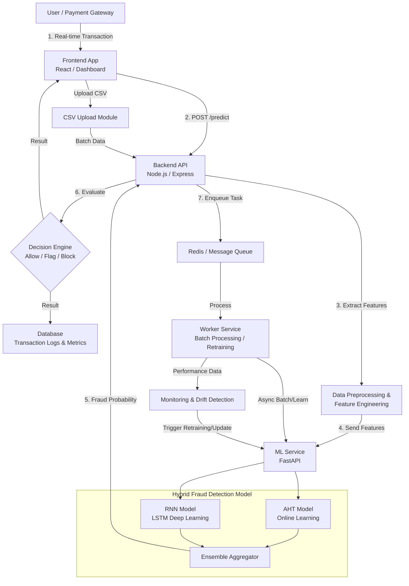
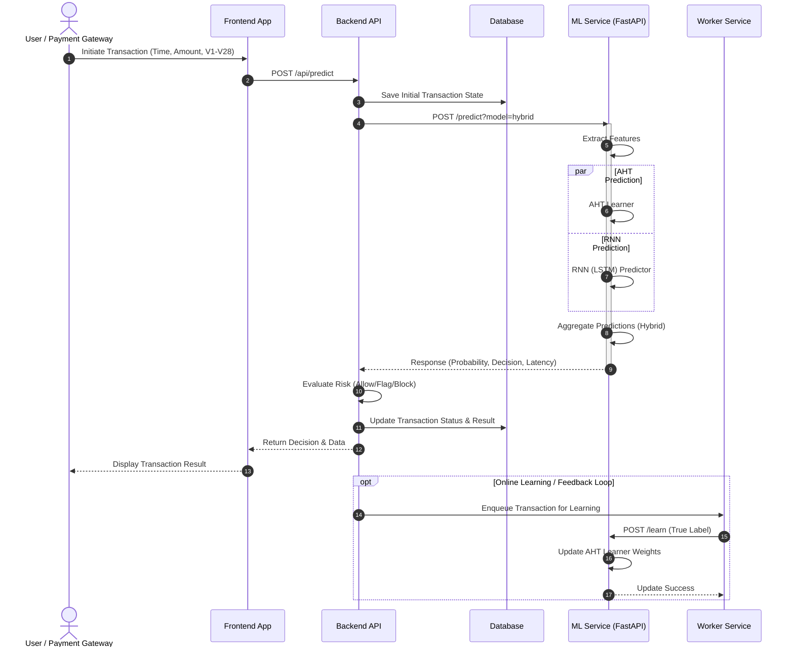
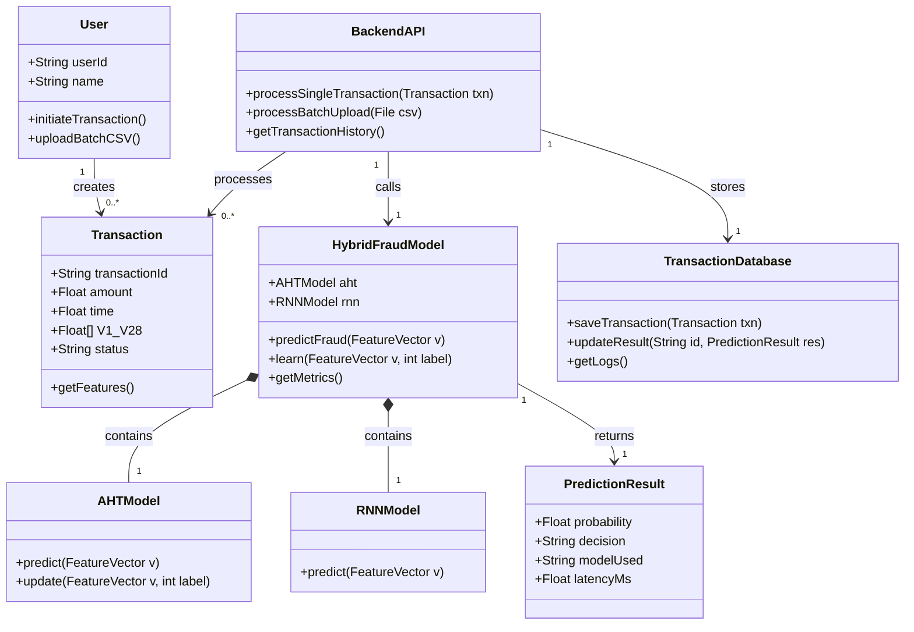

# AHT + RNN Hybrid Fraud Detection System Diagrams

Here are the updated UML diagrams reflecting the new AHT (Adaptive Hoeffding Tree) + RNN (LSTM) hybrid architecture.

## 1. System Architecture Diagram



## 2. Sequence Diagram



## 3. Class Diagram



## 4. Deployment Diagram

```mermaid
flowchart TD
    subgraph Client Device
        Browser[Web Browser / Dashboard]
    end

    subgraph "Application Server (Node.js)"
        UI[Frontend Server (Vite / React)]
        API[Backend Server (Express)]
        Worker[Worker Process (BullMQ)]
    end

    subgraph "ML Server (Python)"
        ML[FastAPI ML Service]
        AHT[(AHT Artifacts)]
        RNN[(RNN/LSTM Artifacts)]
    end

    subgraph "Data Layer"
        PG[(PostgreSQL Database)]
        Redis[(Redis Cache / Queue)]
    end

    Browser <-->|HTTPS| UI
    Browser <-->|REST API| API
    
    API <-->|HTTP POST| ML
    API <-->|TCP/IP| PG
    API <-->|TCP/IP| Redis
    
    Worker <-->|TCP/IP| Redis
    Worker <-->|HTTP POST| ML
    
    ML --- AHT
    ML --- RNN
```

## 5. Use Case Diagram

```mermaid
%%{init: {'theme': 'default', 'usecase': {'fill': '#f9f9f9', 'stroke': '#333'}}}%%
usecaseDiagram
    actor "User / Payment Gateway" as U
    actor "System Admin / Analyst" as A
    actor "Automated Worker" as W

    rectangle "Fraud Detection System" {
        usecase "Initiate Single Transaction" as UC1
        usecase "Upload Batch CSV" as UC2
        usecase "Evaluate Transaction Risk" as UC3
        usecase "Predict Fraud (AHT + RNN)" as UC4
        usecase "View Analytics Dashboard" as UC5
        usecase "Monitor Model Metrics" as UC6
        usecase "Online Model Retraining" as UC7
        usecase "Review Flagged Transactions" as UC8
    }

    U --> UC1
    U --> UC2

    UC1 ..> UC3 : <<includes>>
    UC2 ..> UC3 : <<includes>>
    UC3 ..> UC4 : <<includes>>

    A --> UC5
    A --> UC6
    A --> UC8

    W --> UC7
    UC7 ..> UC4 : <<extends>>
```
